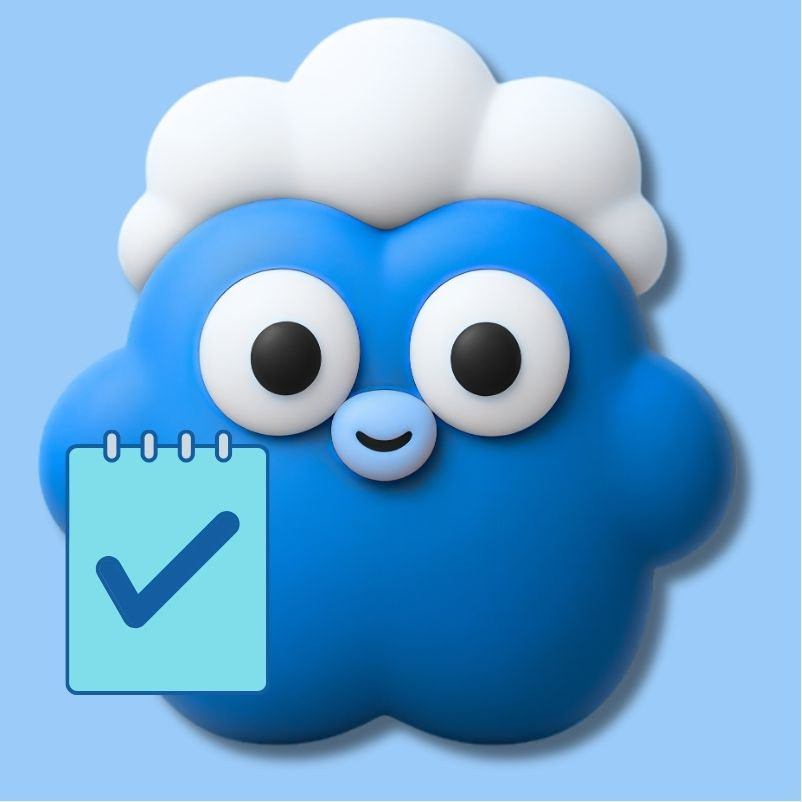

<div align="center">
  
</div>


# Tasks


**Tasks** is a productivity app that helps you Create tasks, organize them into categories, make custom lists, set reminders so you never miss a deadline, and run focused work sessions with built-in timers. It's built entirely in Flutter with a glassmorphic UI design, and it's completely free, no ads, no hidden catches.


---

## Table of Contents

- [Introduction](#introduction)
- [Features](#features)
- [Tech Stack](#tech-stack)
- [Project Structure](#project-structure)
- [Getting Started](#getting-started)
- [Download](#download)
- [Author](#author)
- [Company](#company)
- [Legal Documentation](#legal-documentation)
- [UI Screenshots](#ui-screenshots)

## List of Tables

| Table | Description |
|-------|-------------|
| [Tech Stack](#tech-stack) | Technologies and libraries used |
| [Project Structure](#project-structure) | Folder and file overview |
| [Features](#features) | Full feature breakdown |

---

## Introduction

We all have busy lives, work deadlines, study sessions, errands to run, and a hundred things to keep track of. **Tasks** was built to make that a little easier. It's a modern, good-looking app where you can jot down your tasks, give them due dates and times, mark them as important, and organize them into your own custom lists. You'll get reminded when tasks due is close and/or you miss them, so nothing slips through the cracks.

But Tasks isn't just a todo list. It also has **Sessions**, think of them as Pomodoro-style work blocks where you pick the tasks you want to tackle, set how long each one takes, and the app keeps you on track with a timer. When you're done, you get a notification saying "Great work!".

Everything syncs to the cloud using Firebase, so your data is always safe and available across devices. You can sign up with your email or just use Google Sign-In. The whole thing is wrapped in a soft, glassmorphic design, not boring corporate like. And the best part? It's completely free. No ads, no subscriptions, no data selling. Just a tool that works.

---

## Features

| Feature | Description |
|---------|-------------|
| **Task Management** | Create, edit, delete, and toggle tasks with due dates, times, and importance flags |
| **Categories** | Sort tasks by Study, Work, or Home, plus create your own custom lists with range of icons and colors |
| **Smart Reminders** | Get notified 12 hours before, 2 hours before, and when a task is missed |
| **Focused Sessions** | Build work sessions with multiple tasks and breaks, run them with a live timer |
| **Profile & Stats** | Choose an avatar, edit your name, and track tasks completed and sessions finished |
| **Custom Lists** | Create your own task categories with custom icons and colors |
| **Authentication** | Sign up with email/password or Google Sign-In, with email verification |
| **Account Management** | Update your email, change your password, or delete your account |
| **Legal Pages** | Privacy Policy, Terms & Conditions, and EULA accessible in-app |

---

## Tech Stack

| Layer | Technology |
|-------|------------|
| **Framework** | Flutter (Dart SDK ^3.11.1) |
| **Backend** | Firebase (Auth, Firestore, Cloud Functions) |
| **Database** | Firestore |
| **Design** | Stitch |
| **Authentication** | Email/Password + Google Sign-In |
| **State Management** | Flutter Riverpod |
| **Notifications** | awesome_notifications |
| **Navigation** | curved_navigation_bar |
| **Icons** | font_awesome_flutter |

---

## Project Structure

```
legal_documentation/
├── end_user_license_agreement                    
├── terms_and_conditions                 
└──  end_user_license_agreement
source_code/
├── lib/
│   ├── main.dart              -> App entry, Firebase init, AuthGate
│   ├── constants.dart         -> Design system (colors, text, spacing)
│   ├── models/                -> 2 models: Task, Session
│   ├── providers/             -> 3 providers: auth, services, session providers
│   ├── screens/               -> 20 screens: (home, login, profile, etc.)
│   ├── services/              -> 5 Services: auth, task, session, remainder, notification services
│   └── widgets/               -> 14 reusable UI components: app bar, bottom nav bar, glass card, google login button etc
├── android/                   -> Android project
├── assets/                    -> logos, avatars, fonts
├── functions/                 -> Cloud Functions (TypeScript)
├── test/                      -> Unit tests
└── pubspec.yaml               -> Dependencies
ui_screenshots/                ->29 screenshots images of apps's user interface
.gitignore
README.md
```

---

## Getting Started

### Prerequisites

- [Flutter SDK](https://flutter.dev/docs/get-started/install) (^3.11.1)
- [Firebase CLI](https://firebase.google.com/docs/cli)
- [A Firebase project](https://console.firebase.google.com/)   (literaly takes 5 minutes to create your own firebase project)

### Setup

1. **Clone the repository**

   ```bash
   git clone https://github.com/glasneph/tasks.git
   cd tasks/flutter_frontend
   ```

2. **Install dependencies**

   ```bash
   flutter pub get
   ```

3. **Configure Firebase**

   - Place your `google-services.json` in `android/app/`
   - Or run `flutterfire configure` to auto-generate it

4. **Run the app**

   ```bash
   flutter run
   ```

### Build Release

```bash
# Android (AAB for Play Store)
flutter build appbundle --release --no-tree-shake-icons

# Android (APK for direct install)
flutter build apk --release --no-tree-shake-icons
```

> **Note:** The `--no-tree-shake-icons` flag is required because some screens use non-constant `IconData` instances with custom colors (e.g., colorful list icons on the Home and My Lists screens), this inconsitency is not an problem, its intentional by the developer, so simply add the flag at the end, without it, Flutter's icon tree-shaking optimization will fail during the release build.

---

## Download

single click download links:

> Download the latest APK: [Direct Link](https://github.com/huzaifa4khtar/Tasks-by-Glasneph/releases/download/v1.0.0/Tasks_v1.0.0.apk).

> Download Souce code Zip: [Direct Link](https://github.com/huzaifa4khtar/Tasks-by-Glasneph/archive/refs/tags/v1.0.0.zip). 
---

## Author

**Huzaifa Akhtar**
- GitHub: [huzaifa4khtar](https://github.com/huzaifa4khtar)
- Instagram: [@huzaifa4khtar](https://www.instagram.com/huzaifa4khtar/)

## Company

**Glasneph™**
- Github: [glasneph](https://github.com/glasneph)
- Instagram: [@glasneph](https://www.instagram.com/glasneph/)

---

## Legal Documentation

- [Privacy Policy](https://glasneph.github.io/tasks_legal_documentation/privacy_policy.html)
- [End User License Agreement](https://glasneph.github.io/tasks_legal_documentation/end_user_license_agreement.html)
- [Terms and Conditions](https://glasneph.github.io/tasks_legal_documentation/terms_and_conditions.html)

---

## UI Screenshots

<table>
  <tr>
    <td></td>
    <td></td>
    <td></td>
  </tr>
  <tr>
    <td></td>
    <td></td>
    <td></td>
  </tr>
  <tr>
    <td></td>
    <td></td>
    <td></td>
  </tr>
  <tr>
    <td></td>
    <td></td>
    <td></td>
  </tr>
  <tr>
    <td></td>
    <td></td>
    <td></td>
  </tr>
  <tr>
    <td></td>
    <td></td>
    <td></td>
  </tr>
  <tr>
    <td></td>
    <td></td>
    <td></td>
  </tr>
  <tr>
    <td></td>
    <td></td>
    <td></td>
  </tr>
  <tr>
    <td></td>
    <td></td>
    <td></td>
  </tr>
  <tr>
    <td></td>
    <td></td>
    <td></td>
  </tr>
</table>
